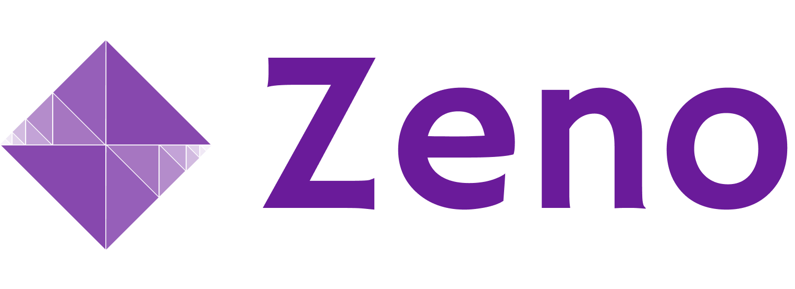

Zeno is a general-purpose framework for evaluating machine learning models.
It combines a **Python API** with an **interactive UI** to allow users to discover, explore, and analyze the performance of their models across diverse use cases.
Zeno can be used for any data type or task with _modular views_ for everything from object detection to audio transcription.

## Getting Started

Check out the quickstart tutorial and API reference to get started with Zeno:

- [Introduction](http://zenoml.com/docs/intro/) - Learn more about Zeno.
- [Getting Started](http://zenoml.com/docs/intro/get_started) - Setup Zeno with your own data and models.
- [CIFAR-10 Example](http://zenoml.com/docs/intro/cifar) - Learn how to use Zeno with a CIFAR-10 classification example.
- [Documentation & API](http://zenoml.com/docs/intro/) - Full documentation and API reference.
