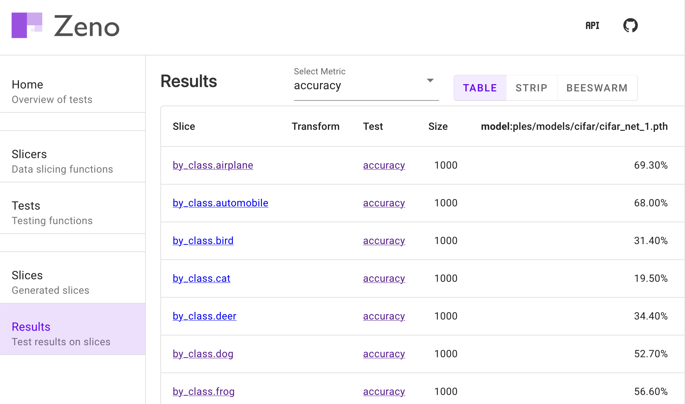

# ML Testing with Zeno

Zeno is an API and interface for evaluating machine learning models.
You first define how you expect a model to behave for subsets of data, and optionally after transformations.
The UI then allows you to explore and compare the results across models.

````{panels}
:card: border-2
Write simple `slicing` and `metric` functions:
^^^
```python
@slicer(["accuracy"])
def medium_sample(data, metad):
    return metad.sample(100).index

@metric
def accuracy(out, metad):
    return metad[
           metad["lab"] == out].shape[0]
           / (metad.shape[0]) * 100
```
---

Analyze & compare models with a powerful UI:
^^^



````

The tests are connected as follows. Slices are optionally passed to transforms, which are then passed to have metrics calculated.

```{image} flow.png
:alt: flow
:width: 500px
:align: center
```

## Quickstart

```bash
pip install zenoml
```

Next, create at least one testing file with both a `load_model` and `load_data` function.
Additionally add any number of tests using the `preprocess`, `slicer`, `transform` and `metric` functions.
See [Writing Tests](writing_tests) for details on each of these functions.

Run the tests and load the ui with the zeno command:

```bash
zeno test.py
    --metadata data.csv
    --data-path data
    --models model.pth
```

See [Running Tests](api) for the various command line options and [Test Examples](test-examples) for various example tests.

## Table of Contents

```{tableofcontents}

```
